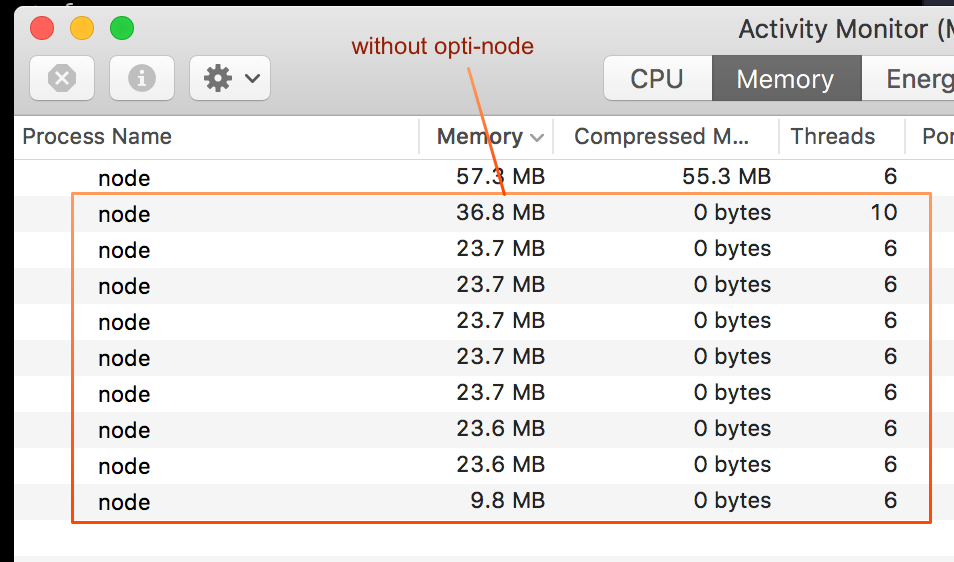
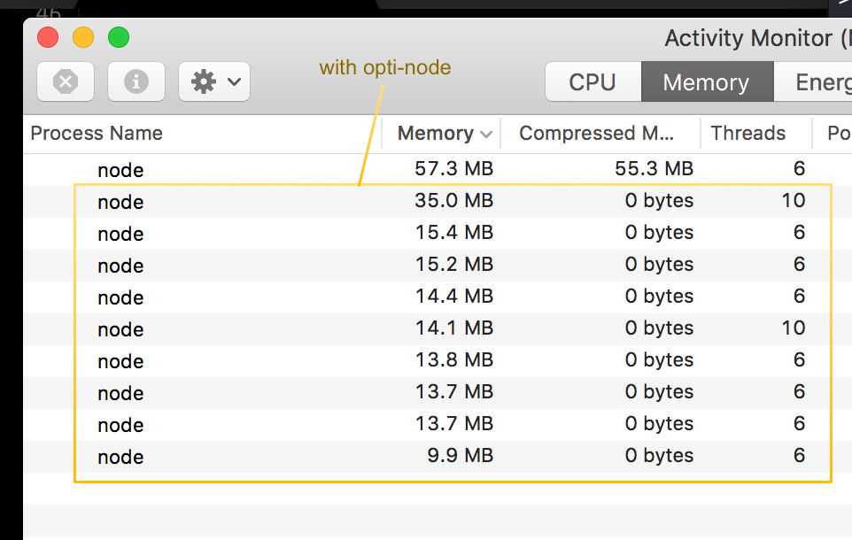

# Idle

This is a basic test running eight cluster workers with or without opti-node. The opti-node side did prodice a slightly lower memory footprint while the processes simply idle.

## Without opti-node

## __With__ opti-node

